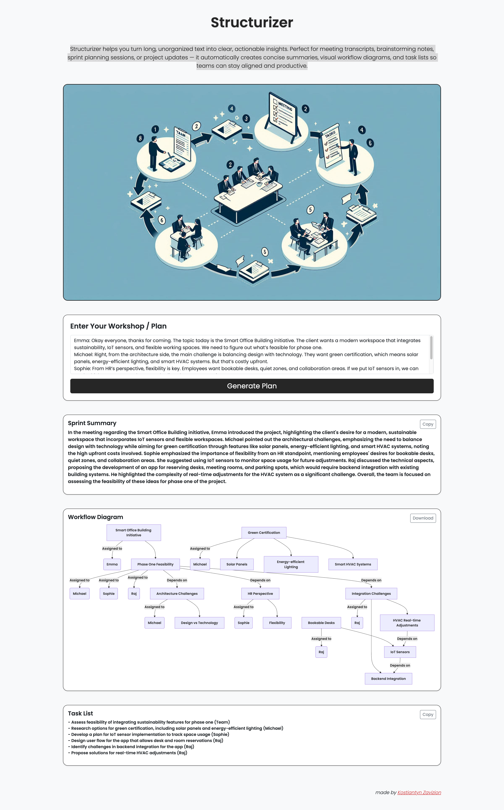

# AI SaaS Demo
My AI-powered SaaS platform which uses chatGpt model. Features include workshop summarization, task extraction, and diagram generation.

## 📸 Preview

## Setup
1. Install dependencies: `pip install -r requirements.txt` and `cd frontend && npm install`
2. Set up .env with Hugging Face and AWS credentials
3. Run locally: `uvicorn api.main:app --reload` and `npm start` (frontend)
4. Deploy to AWS: Run `scripts/deploy.sh`

## Notes
- Using AWS free tier (S3, Lambda, DynamoDB) to keep costs ~$0.
- FAISS for vector DB to avoid Pinecone's $70/month.
- Grok 3/Hugging Face free tier for LLMs instead of OpenAI.

## 🚀 Local Installation & Testing

This project consists of a **FastAPI backend** and a **React frontend**, which need to be run separately for local testing.  
- The **backend** handles summarization, task extraction, and diagram generation (using Hugging Face LLMs + FAISS).  
- The **frontend** provides a browser interface.  

---

### 1. Clone & Setup Virtual Environment

git clone <your-repo-url>
cd structurizer
python3 -m venv venv
source venv/bin/activate

### 2. Backend Setup (FastAPI)

Install Python dependencies:

pip install -r requirements.txt

If you use conda:

conda install -c pytorch faiss-cpu

Some systems also require:

brew install swig
pip install uvicorn[standard] fastapi
pip install langchain huggingface-hub langchain_community sentence-transformers

Rename .envexample to .env and add required environment variables!

Run the backend (from root structurizer/):

source venv/bin/activate

uvicorn api.main:app --reload

The backend will start on:

http://127.0.0.1:8000/summarize

http://127.0.0.1:8000/tasks

http://127.0.0.1:8000/diagram

### 3. Frontend Setup (React)

Open a new terminal (separate from backend) and move into frontend:

cd frontend

Install dependencies:

npm install
npm install mdbreact
npm install axios react-router-dom@5

If npm install fails:

brew install node
npm install

Start the frontend:

npm start

The React app will start on:

http://127.0.0.1:3000

### 4. Test Locally

Open http://127.0.0.1:3000 in your browser.

Enter sample text into the input field.

Click Run Demo – you should see:

Summary (from backend LLM)

Tasks (from backend LLM)

Diagram (Mermaid chart rendered in frontend)

✅ At this point, you should have a working local dev environment with FastAPI + React.

